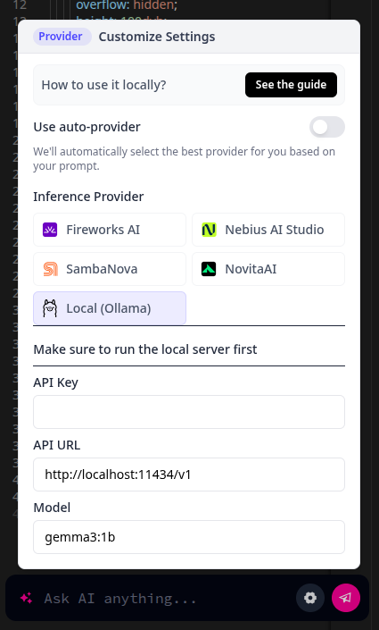

# DeepSite Locally 🚀



Ejecuta **DeepSite** en tu propio entorno, sin depender de Hugging Face!
Perfecto para aquellos que quieren personalizar, integrar o simplemente tener control total sobre la plataforma.

---

## Índice

1. [Requisitos previos](#requisitos-previos)
2. [Instalación](#instalación)
3. [Configuración](#configuración)
4. [Proveedores de IA disponibles](#proveedores-de-ia-disponibles)
5. [Inicio automático](#inicio-automático)
6. [Verificación del estado](#verificación-del-estado)
7. [Solución de problemas](#solución-de-problemas)
8. [Contribuir](#contribuir)

## Requisitos previos

Antes de comenzar, asegúrate de tener instalado:

- **Node.js** (versión 14 o superior)
- **npm** (normalmente viene con Node.js)
- **Git** (para clonar el repositorio)
- **Ollama** (opcional, para ejecutar modelos localmente)

## Instalación

### 1. Clonar el repositorio

```bash
git clone https://github.com/bladealex9848/deepsite-locally.git
cd deepsite-locally
```

### 2. Instalar dependencias

```bash
npm install
```

### 3. Configurar el entorno

Copia el archivo de ejemplo de configuración:

```bash
cp .env.example .env
```

Edita el archivo `.env` y añade tus claves API para los proveedores que desees utilizar.

### 4. Iniciar el servidor

```bash
npm start
```

Una vez iniciado, DeepSite Locally estará disponible en:

```
http://localhost:5173
```

## Configuración

El archivo `.env` contiene toda la configuración necesaria para DeepSite Locally. A continuación se detallan las secciones principales:

### Configuración básica

```
OAUTH_CLIENT_ID=
OAUTH_CLIENT_SECRET=
APP_PORT=5173
REDIRECT_URI=http://localhost:5173/auth/login
DEFAULT_HF_TOKEN=
```

### Hugging Face (opcional)

```
# Optional
# By setting this variable, you will bypass the login page + the free requests
# and will use the token directly.
# This is useful for testing purposes or local use.
# IMPORTANT: Make sure this token has 'write' permissions for Spaces
HF_TOKEN=
```

### Ollama (Local AI)

```
# Optional - Local AI API (Ollama) - FUNCIONANDO
LOCAL_API_URL=http://localhost:11434/v1
LOCAL_API_KEY=
LOCAL_MODEL=qwen3:4b
```

## Proveedores de IA disponibles

DeepSite Locally soporta múltiples proveedores de IA. A continuación se detallan los proveedores configurados y sus modelos:

### Proveedores funcionando

| Proveedor | Modelo | Descripción |
|-----------|--------|-------------|
| **OpenAI** | gpt-4.1-nano | Modelo más reciente y eficiente de OpenAI |
| **DeepSeek** | deepseek-chat | Modelo de chat de DeepSeek |
| **OpenRouter** | deepseek/deepseek-chat-v3-0324:free | Acceso a modelos de diferentes proveedores |
| **Together AI** | Qwen/Qwen2.5-Coder-32B-Instruct | Modelo especializado en código |
| **Groq** | meta-llama/llama-4-maverick-17b-128e-instruct | Modelo Llama 4 con alta velocidad |
| **DeepInfra** | Qwen/Qwen2.5-Coder-32B-Instruct | Modelo Qwen especializado en código |
| **Mistral** | codestral-latest | Modelo especializado en código |
| **Cohere** | command-r-plus | Modelo Command R+ de Cohere |
| **Ollama (Local)** | qwen3:4b | Modelo local que no requiere conexión a internet |

### Proveedores no disponibles

| Proveedor | Estado | Motivo |
|-----------|--------|--------|
| **Anthropic** | No funciona | Saldo insuficiente |
| **Google Gemini** | No probado | Requiere configuración adicional |

## Inicio automático

DeepSite Locally puede configurarse para iniciarse automáticamente al arrancar tu sistema.

### Configuración en macOS

1. Edita el archivo `setup-autostart-mac.sh` para actualizar la variable `PROJECT_DIR` con la ruta correcta a tu proyecto.
2. Haz el script ejecutable:
   ```bash
   chmod +x setup-autostart-mac.sh
   ```
3. Ejecuta el script:
   ```bash
   ./setup-autostart-mac.sh
   ```

### Configuración en Windows

1. Edita el archivo `setup-autostart-windows.bat` con el Bloc de notas para actualizar la variable `PROJECT_DIR` con la ruta correcta a tu proyecto.
2. Haz clic derecho en `setup-autostart-windows.bat` y selecciona "Ejecutar como administrador".

Para más detalles sobre la configuración de inicio automático, consulta el archivo [README-AUTOSTART.md](./README-AUTOSTART.md).

## Verificación del estado

Para verificar el estado de DeepSite Locally, puedes usar el script `check-status.sh` (en macOS) o `check-server-status.bat` (en Windows):

```bash
./check-status.sh
```

Este script mostrará información sobre:
- Si el servidor está en ejecución
- El PID del proceso
- El tiempo de ejecución
- El estado del servicio de inicio automático

## Solución de problemas

### El servidor no inicia

1. Verifica que todas las dependencias estén instaladas:
   ```bash
   npm install
   ```

2. Verifica que el puerto 5173 no esté en uso:
   ```bash
   lsof -i :5173  # En macOS/Linux
   netstat -ano | findstr :5173  # En Windows
   ```

3. Revisa los logs:
   ```bash
   cat ~/Library/Logs/DeepSite.log  # En macOS
   ```

### Problemas con los proveedores de IA

1. Verifica que las claves API en el archivo `.env` sean correctas.
2. Ejecuta el script de prueba de proveedores:
   ```bash
   node test-providers.js
   ```

3. Para probar un proveedor específico (por ejemplo, OpenAI):
   ```bash
   node test-openai.js
   ```

## Contribuir

Las contribuciones son bienvenidas! Si encuentras un error o tienes una sugerencia, por favor crea un issue o envía un pull request.

---

## Palabras clave
deepsite alojamiento local, ejecutar deepsite localmente, deepsite auto-alojado, cómo ejecutar deepsite localmente, instalar deepsite en tu máquina, configuración de servidor local deepsite, modo offline deepsite, tutorial de localhost deepsite, desplegar deepsite en tu propio servidor, guía de auto-instalación deepsite, cómo alojar deepsite en localhost paso a paso, ¿puede deepsite funcionar sin conexión en mi computadora?, guía de instalación de docker deepsite, guía completa para ejecutar deepsite localmente sin internet, comparación de auto-alojamiento vs alojamiento en la nube de deepsite, consejos de rendimiento para ejecutar deepsite localmente, requisitos para ejecutar deepsite en entorno local, mejores prácticas para auto-alojar la plataforma deepsite, cómo acelerar deepsite en un entorno local, errores comunes al ejecutar deepsite localmente y cómo solucionarlos, comparación de ejecución local de deepsite vs otros constructores de sitios con IA, principales razones para ejecutar deepsite en tu propio servidor, ¿es deepsite de código abierto y compatible con entornos locales?

---

Autor: Alexander Oviedo Fadul
